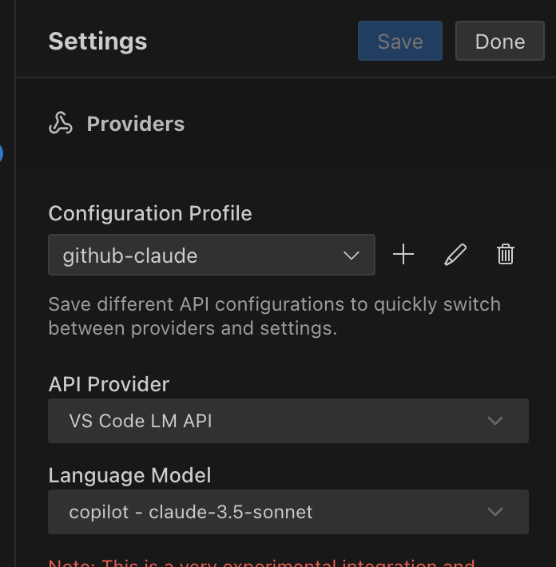
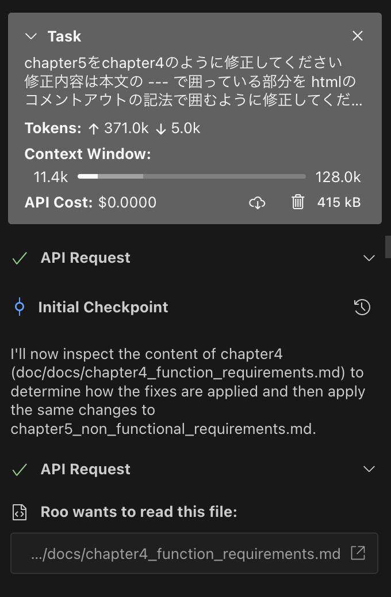
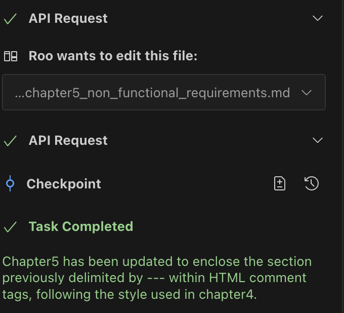
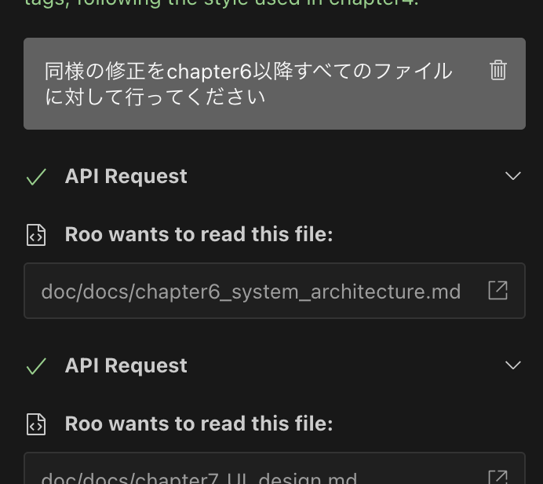

最近、Windsurf, CursorといったAIがアシスタントをしてくれるコードエディタの話題をよく耳にします
とはいえVSCodeでの開発に慣れてしまい新しいコードエディタには以降できずGithub Copilotでコード補完を行うくらいの用途に留まってしまっていました
RooCodeという拡張機能を使えばVSCodeでも他のAIコードエディタのように自動化が行えそうということで試してみました

<!-- truncate -->

## RooCodeの特徴

## RooCodeのセットアップ

今回はざっくりAIコーディングを体験することが目標のためGithub Copilotの無料プランを利用しています

RooCodeを以下のように設定していきます

- API Provider: VS Code LM API
- Language Model: copilot - claude-3.5-sonnet



## はじめてのRooCode

この手の王道 TODOアプリを作っていきます

まずはRooCodeに最低限のアプリケーションを作成してもらいます

## 仕様書の雛形を作成する

AIにアプリケーションを作成してもらうために仕様書を準備します

とはいえ仕様書のフォーマットは多種多様なためどのように作るかは悩みどころです

そこで仕様書の雛形からRooCodeに作ってもらいました

RooCodeが提示してきたフォーマットで作成すればAI側も理解しやすい...はず

提示された仕様書はsystem_architectureやsecurity_requirementsなど運用を見据えた完全な仕様書のフォーマットです
まずは最低限のアプリの開発を行うため不要なchapterも多いです

そこでRooCodeに作ってもらったものはサンプルとして残しつつ本文はすべてTODOに直してもらい、後で肉付けできるようにしていきます

まずなんでも良いのでファイルを１つ以下のように修正します

```
---
sidebar_position: 4
---

<!-- 本分をTODOのみとし, 残りはコメントアウトする -->

TODO

<!--
## 4.1 コア機能
- **ユーザー認証**: 登録、ログイン、パスワードリセット
- **データ管理**: CRUD操作（作成、読み取り、更新、削除）
- **レポート出力**: 集計レポート、ダッシュボード表示

## 4.2 補助機能
- **通知機能**: メール通知、プッシュ通知
- **検索機能**: キーワード・フィルタリングによる検索
-->
```

続いてRooCodeで以下のように指示します
```
chapter5をchapter4のように修正してください
修正内容は本文の --- で囲っている部分を htmlのコメントアウトの記法で囲むように修正してください
```

するとRooCodeがchapter5のファイルも修正してくれました





完成したMarkdownがこちらです 見事の同等の内容でファイルの修正を行ってくれています
```
---
sidebar_position: 5
---

# 5. 非機能要件

TODO

<!--
- **パフォーマンス**: レスポンスタイム平均500ms以内
- **信頼性**: サービス稼働率99.9%以上
- **セキュリティ**: HTTPS通信、SQLインジェクション対策、認証強化
- **保守性**: モジュール設計、詳細なドキュメント整備
-->
```

残りのファイルも同じように修正してもらいましょう



## はじめてのRustプログラム

典型的な"Hello, World!"プログラムを作成してみましょう。

```rust
fn main() {
    println!("Hello, World!");
}
```

## 変数と型

Rustの変数は、デフォルトでイミュータブル（不変）です。

```rust
let x = 5; // イミュータブル
let mut y = 5; // ミュータブル

y = 6; // OK
// x = 6; // コンパイルエラー
```

## 所有権システム

Rustの特徴的な機能である所有権システムの例を見てみましょう。

```rust
fn main() {
    let s1 = String::from("hello");
    let s2 = s1; // s1の所有権がs2に移動
    
    // println!("{}", s1); // コンパイルエラー
    println!("{}", s2); // OK
}
```

## まとめ

Rustは、以下のような場面で特に活躍します：

- システムプログラミング
- WebAssembly開発
- ネットワークプログラミング
- 組み込みシステム開発

安全性と速度を両立させる特徴から、多くの企業で採用が進んでいます。継続的な学習のために、以下のリソースがお勧めです：

- [The Rust Programming Language](https://doc.rust-lang.org/book/)
- [Rust by Example](https://doc.rust-lang.org/rust-by-example/)
- [Rustlings](https://github.com/rust-lang/rustlings/)

次回は、Rustの実践的な使用例として、簡単なCLIツールの作成について解説する予定です。