最近、Windsurf、CursorといったAIアシスタント機能を備えたコードエディタが注目を集めています。
しかし、VSCodeでの開発に慣れているため、新しいエディタへの移行は躊躇してしまい、GitHub Copilotによるコード補完程度の利用に留まっていました。
そこで、VSCode上で同様のAIアシスタント機能を実現できるRooCode拡張機能を試してみることにしました。

<!-- truncate -->

## RooCodeの特徴

RooCodeには以下のような特徴があります：

### 1. VSCode拡張機能として動作

- お気に入りのエディタでAIコーディング支援を利用可能
- 既存の開発環境を大きく変更する必要がない
- VSCodeの機能や他の拡張機能と併用できる

### 2. ファイルシステムの理解

- プロジェクト内の複数のファイルを同時に読み込んで理解
- ディレクトリ構造を把握し、適切なファイル配置を提案
- 仕様書やドキュメントを読み込んでコードを生成

### 3. コンテキストを考慮した開発支援

- ファイル間の依存関係を理解した修正提案
- 既存コードのスタイルに合わせたコード生成
- プロジェクト全体を考慮したリファクタリング提案

### 4. インタラクティブな開発フロー

- 段階的な開発プロセスをサポート
- 変更内容の説明と確認を対話形式で実施
- エラーや問題点の詳細な解説と修正提案

## RooCodeのセットアップ

今回は簡単にAIコーディングを体験することが目標のため、GitHub Copilotの無料プランを利用することにしました。

RooCodeの設定は非常にシンプルで、以下の2点を指定するだけです：

- API Provider: VS Code LM API（GitHub Copilotと連携）
- Language Model: copilot - claude-3.5-sonnet（高性能な言語モデル）


## はじめてのRooCode

この手の王道、TODOアプリを作っていきます。

まずはRooCodeに最低限のモックアプリケーションを作成してもらいます。

## 仕様書の雛形を作成する

AIにアプリケーションを作成してもらうために仕様書を準備します。

とはいえ仕様書のフォーマットは多種多様なため、どのように作るかは悩みどころです。

そこで仕様書の雛形をRooCodeに作ってもらいました。RooCodeが提示してきたフォーマットで作成すればAI側も理解しやすいと考えました。

プロンプト
```
アプリケーションを作成する仕様書のサンプルを教えてください markdownで作成する予定です
```

出力(長いので最初の少しのみ)


章立ては以下のような内容です
```
1. 概要
2. 目的
3. 対象ユーザー
4. 機能要件
5. 非機能要件
6. システム構成
7. UI設計
8. データベース設計
9. セキュリティ要件
10. テスト計画
11. スケジュール／マイルストーン
12. まとめ
```

対象ユーザーや機能要件などアプリケーションの開発に必要な内容に加えセキュリティやテスト計画などリリースに向けて工程も含めた完全な仕様書のサンプルを作成してくれました

とはいえモックを作るだけであればほとんどの章は必要ないので一旦以下のようにTODOと記載してサンプルはコメントアウトしておきます。

```
---
sidebar_position: 4
---

<!-- 本文をTODOのみとし、残りはコメントアウトする -->

TODO

<!--
## 4.1 コア機能
- **ユーザー認証**: 登録、ログイン、パスワードリセット
- **データ管理**: CRUD操作（作成、読み取り、更新、削除）
- **レポート出力**: 集計レポート、ダッシュボード表示

## 4.2 補助機能
- **通知機能**: メール通知、プッシュ通知
- **検索機能**: キーワード・フィルタリングによる検索
-->
```

## 最低限の仕様書を作成する

まずは最低限のアプリを作ってもらうため、以下の仕様書を作成していきます。
作成するTODOアプリの概要を記載していきます。

- 1. 概要(chapter1_overview.md)
- 2. 目的(chapter2_objectives.md)
- 3. 対象ユーザー(chapter3_target_users.md)
- 4. 機能要件(chapter4_function_requirements.md)

```markdown
# 1. 概要

本仕様書は、アプリケーションの開発に必要な各種要件や設計方針を示すドキュメントです。  
これにより、開発チーム全体が統一の認識を持ち、効率的かつ円滑なプロジェクト進行を目指します。
```

```markdown
# 2. 目的

本アプリケーションは、ユーザーが日常のあらゆるタスクややるべきことを簡単にまとめ、効率的に管理できる環境を提供することを目的としています。従来のタスク管理ツールとは一線を画し、シンプルで直感的な操作により、利用者が毎日のルーチンを一元的に把握し、整理できるよう設計されています。

- ユーザーのタスク管理の利便性向上
- 日常のやることを簡単に可視化し、合理的に整理することによる生産性の向上
```

```markdown
# 3. 対象ユーザー

タスク管理を必要とするユーザーは、以下の用途でシステムを利用します：
 
- 日常のタスク管理を効率的に行いたい
- 買い物リストやメモとして利用したい
- お出かけ時の備忘録として利用したい
```

```markdown
# 4. 機能要件

システムが提供する機能は以下の通りです。

## 4.1 コア機能
- チェックボックス形式で複数のTODOを追加可能
- TODOリストにコメントを追記可能
- TODOリストへのタグ付けとフィルタリングが可能
```

## RooCodeにアプリを作成してもらう

早速仕様書の内容でRooCodeにアプリを作成してもらいます。

プロンプト
```
doc/docs以下の内容でアプリケーションを作成してください
本文にTODOと記載されたMarkdownファイルは無視してください
```

指示内容を認識できていそうです！ RooCodeがどのように仕様書を読み取るか確認していきましょう。

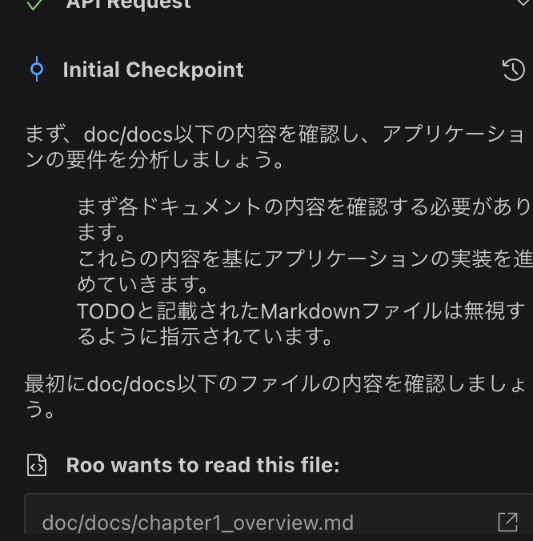

まず、概要の内容から読み取っているファイルが仕様書であることを認識できています。

はじめに読み込ませているドキュメントがどのような目的で作られているかは明示したほうがいいかもしれません。

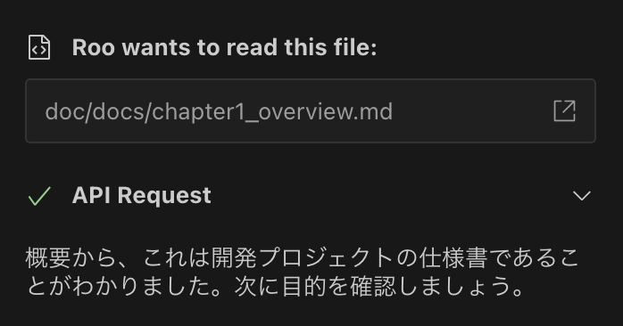

開発するアプリの内容と

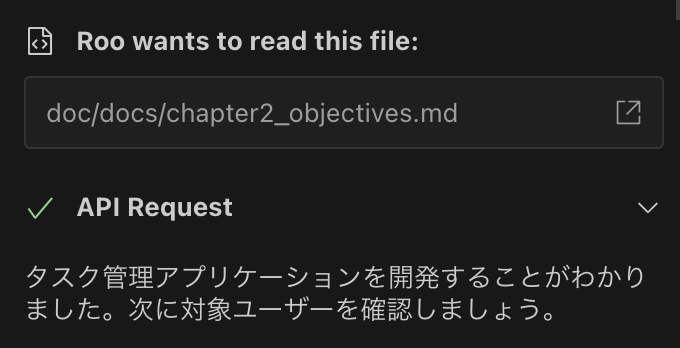

対象のユーザーも理解できています。要約もしてくれました。

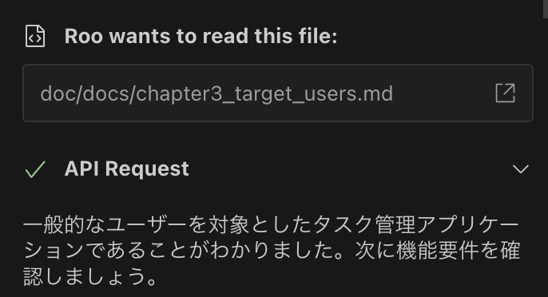

機能要件の理解もOKです。

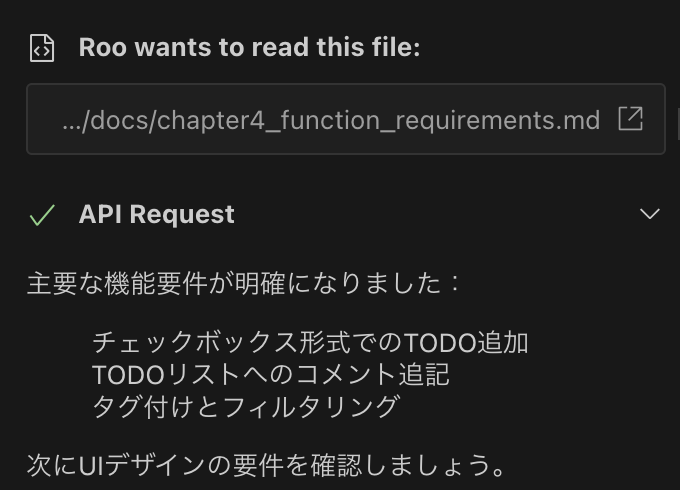

これ以降のファイルはすべてTODOとしています。

初めのプロンプトで指示した通り、TODOとなっているファイルは無視してくれています。

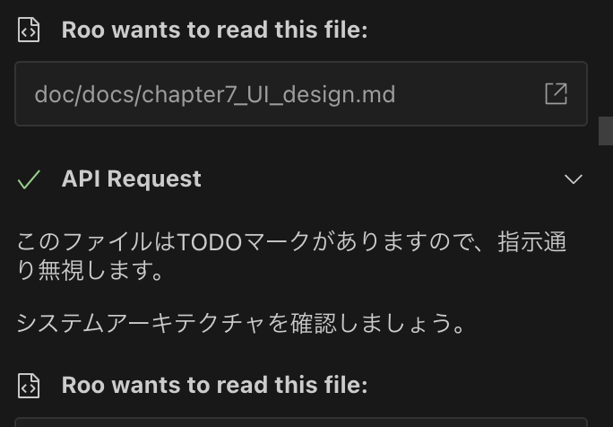

作成するアプリの内容を理解したうえで開発方針を示してくれました。
モックを作っている段階なので、HTML + JavaScript + CSSの一番シンプルな形で問題ありません。
動作確認をするのも簡単なので、下手にフレームワークを提示されるよりは良いかもしれません。

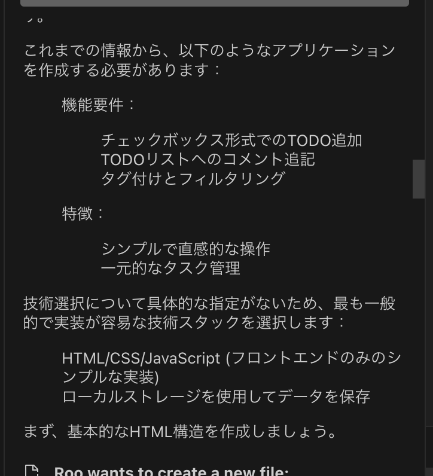

HTML、CSS、そしてJavaScriptを順々に作成してくれています。

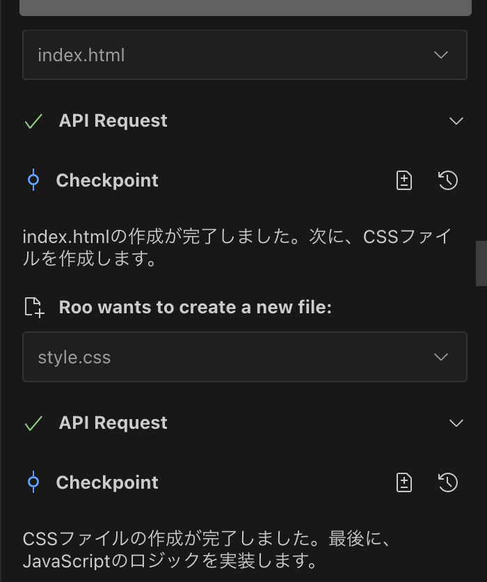

無事完成です！ 動作確認方法も教えてくれています。

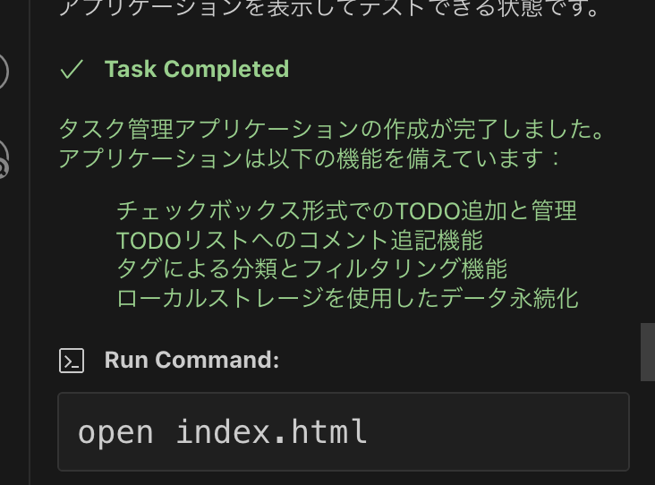

早速動かしてみましょう。
想定している通りの機能で動いています！

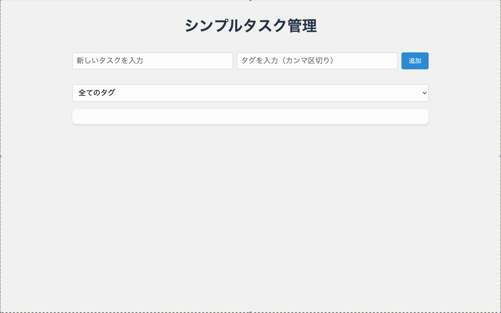

## RooCodeに作成したアプリを修正してもらう

続いて完成したアプリをカスタマイズしてもらいます。

現在のアプリだと同じタグであっても毎回入力する必要があります。
一度使ったことあるタグは入力補完があるとより便利に利用できそうです。

早速仕様書を修正していきます。4. 機能要件に以下の項目を追加します。

```markdown
## 4.2 補助機能
- 一度入力したタグは補完される
```

RooCodeに指示してみましょう。

プロンプト
```
chapter4に修正を加えました アプリケーションを修正してください
```

指示通り修正があったファイルを確認してくれています。

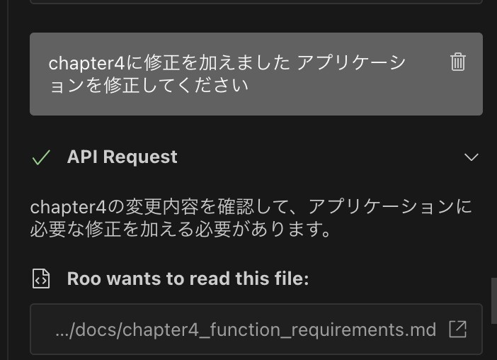

変更内容を理解できています！ ソースコードの修正内容も問題なさそうなのでこのまま修正してもらいましょう。


修正完了です！ 早速動かしてみましょう。

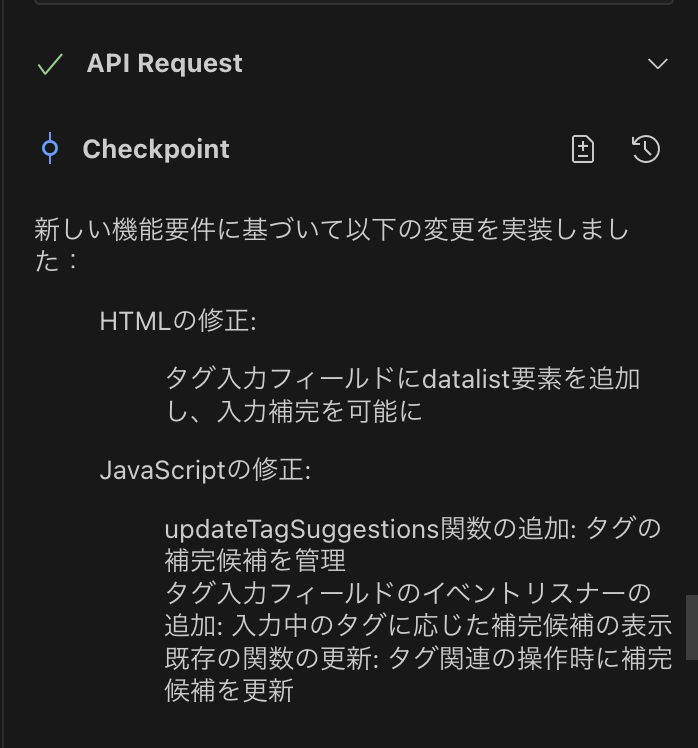

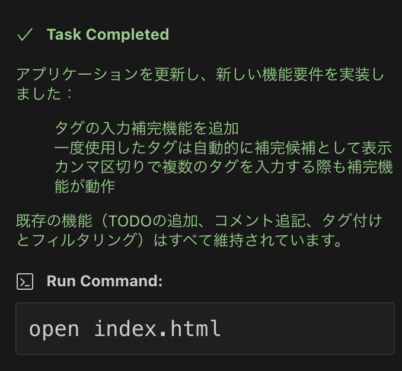

一度入力したことのあるタグを選択して補完できるようになりました！

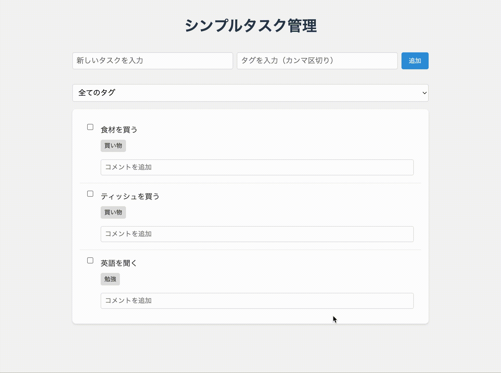

## まとめ

RooCodeを使用することで、従来のチャットベースのAIアシスタントとは一線を画す、より高度な開発支援を体験することができました。特に以下の点が印象的でした：

- プロジェクト全体のコンテキストを理解した開発支援
- 複数ファイルの同時読み込みと関連性の把握
- コードの差分を理解した的確な修正提案
- 仕様書からの自動コード生成

今回のチュートリアルでは、シンプルなモックアプリの作成に留めましたが、仕様書を書いてRooCodeに指示するだけで、驚くほど簡単にアプリケーションを作成できることが分かりました。

次回は、より実践的なアプリケーション開発に挑戦する予定です。具体的には以下の要素を含めた開発を行っていきます：

- 開発言語とフレームワークの明確な指定
- プロジェクトのディレクトリ構成の設計
- iOS/Android/デスクトップアプリなどターゲットプラットフォームの指定
- データベース設計やAPIインターフェースの実装

RooCodeを活用することで、より効率的で質の高い開発プロセスが実現できそうです。