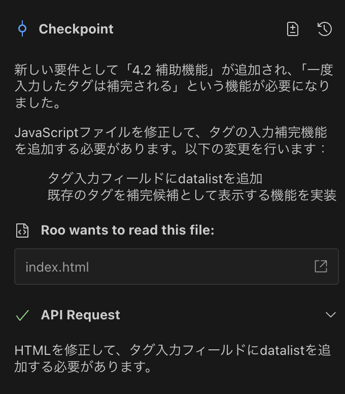

最近、AIアシスタント付きのコードエディタが話題です。
例として、WindsurfやCursorがあります。
しかし、私はVSCodeに慣れているので、
新しいエディタを使うのはちょっと不安でした。
GitHub Copilotのコード補完は使っていましたが、
本格的に使うのはためらっていました。

そこで、VSCode上で使えるRooCode拡張を試してみました。

## RooCodeの特徴

RooCodeの主な機能は次のとおりです：

### 1. VSCode拡張として動作

- お気に入りのエディタで使えます。
- 既存の環境をそのまま利用できます。
- 他の拡張とも一緒に使えます。

### 2. ファイルシステムの理解

- 複数のファイルを同時に読み取ります。
- ディレクトリ構造を把握して最適な配置を提案します。
- ドキュメントからコードを生成します。

### 3. コンテキストを考えた支援

- ファイル間の関係を考慮して提案します。
- 既存のスタイルに合わせたコードを生成します。
- プロジェクト全体を見たリファクタリングが可能です。

### 4. インタラクティブな開発フロー

- ステップごとに進められます。
- 変更点をその場で説明し確認します。
- エラーや問題も詳しく教えてくれます。

## はじめてのRooCode

まずは、基本のTODOアプリを作ります。

RooCodeでシンプルなモックアプリを作成しました。

## 完成したモックアプリ

タグを登録できるTODOアプリです。


下記リンクから試してみてください：
https://sharedo-tm-paseri.netlify.app/mock/secondmock/

仕様書は以下から確認できます：
https://sharedo-tm-paseri.netlify.app/docs/mock1/chapter1_overview

ソースコードはこちらです：
https://github.com/tm-paseri/sharedo/tree/main/doc/mock/secondmock

## RooCodeのセットアップ

今回は、AIコーディングを軽く体験するために
GitHub Copilotの無料プランを利用しました。

設定はとてもシンプルです。下記2点のみ指定します：

- API Provider: VS Code LM API (GitHub Copilot連携)
- Language Model: copilot - claude-3.5-sonnet


## 仕様書の雛形を作成する

AIにアプリ用の仕様書を準備してもらいました。
仕様書のフォーマットは多様ですが、
このフォーマットはわかりやすいです。

プロンプト:
```
アプリ作成の仕様書サンプルを教えてください
markdown形式で作成します
```

最初の出力例はこちら：


仕様書は次の章立てです：

```
1. 概要
2. 目的
3. 対象ユーザー
4. 機能要件
5. 非機能要件
6. システム構成
7. UI設計
8. データベース設計
9. セキュリティ要件
10. テスト計画
11. スケジュール／マイルストーン
12. まとめ
```

ただし、今回はモックアプリなので
一部は省いて「TODO」としています。

```
---
sidebar_position: 4
---

<!-- 本文はTODO。残りはコメントアウト -->
TODO

<!--
## 4.1 コア機能
- ユーザー認証: 登録、ログイン、パスワードリセット
- データ管理: CRUD操作
- レポート出力: 集計レポートとダッシュボード
 
## 4.2 補助機能
- 通知機能: メールやプッシュ通知
- 検索機能: キーワードやフィルタで検索
-->
```

## 最低限の仕様書を作成する

まずはアプリの概要をまとめます。

今回は最低限ということで以下の章を作成しました。

- 1. 概要 (chapter1_overview.md)
- 2. 目的 (chapter2_objectives.md)
- 3. 対象ユーザー (chapter3_target_users.md)
- 4. 機能要件 (chapter4_function_requirements.md)

```markdown
# 1. 概要

本仕様書は、アプリケーションの開発に必要な各種要件や設計方針を示すドキュメントです。  
これにより、開発チーム全体が統一の認識を持ち、効率的かつ円滑なプロジェクト進行を目指します。
```

```markdown
# 2. 目的

本アプリケーションは、ユーザーが日常のあらゆるタスクややるべきことを簡単にまとめ、効率的に管理できる環境を提供することを目的としています。従来のタスク管理ツールとは一線を画し、シンプルで直感的な操作により、利用者が毎日のルーチンを一元的に把握し、整理できるよう設計されています。

- ユーザーのタスク管理の利便性向上
- 日常のやることを簡単に可視化し、合理的に整理することによる生産性の向上
```

```markdown
# 3. 対象ユーザー

タスク管理を必要とするユーザーは、以下の用途でシステムを利用します：
 
- 日常のタスク管理を効率的に行いたい
- 買い物リストやメモとして利用したい
- お出かけ時の備忘録として利用したい
```

```markdown
# 4. 機能要件

システムが提供する機能は以下の通りです。

## 4.1 コア機能
- チェックボックス形式で複数のTODOを追加可能
- TODOリストにコメントを追記可能
- TODOリストへのタグ付けとフィルタリングが可能
```
## RooCodeにアプリ作成を依頼する

仕様書に沿って、RooCodeにアプリ作成を依頼します。

以下のプロンプトで開発を依頼します：
```
doc/docs以下の内容でアプリケーションを作成してください
本文にTODOと記載されたMarkdownファイルは無視してください
```

RooCodeの処理を一つづつ確認してみましょう


まず、概要の内容からドキュメントの目的を確認しています。


開発するアプリの内容と


対象のユーザーを確認しています。要約もしてくれました。


機能要件の確認もOKです。


これ以降のファイルはすべてTODOとしています。

初めのプロンプトで指示した通り、TODOとなっているファイルは無視してくれています。


作成するアプリの内容を理解したうえで開発方針を示してくれました。

HTML + JavaScript + CSSの一番シンプルな形です。

モックの作成なのでこのまま作ってもらいます。


HTML、CSS、そしてJavaScriptを順々に作成してくれています。


無事完成です！ 動作確認方法も教えてくれています。


早速動かしてみましょう。
想定している通りの機能で動いています！

## RooCodeに機能修正を依頼する

次は機能拡張です。

現状、同じタグはタスクの追加ごとに入力し直す必要があります。

これだと使いにくいので、過去のタグを自動補完する機能を追加します。

仕様書の4. 機能要件に以下の項目を追加します。

```markdown
## 4.2 補助機能
- 一度入力したタグは補完される
```

RooCodeに指示してみましょう。

プロンプト
```
chapter4に修正を加えました アプリケーションを修正してください
```

仕様書に合わせて修正内容を提案してくれました。

問題なさそうなのでこのまま修正してもらいましょう。



修正完了です！

早速動かしてみましょう。


一度入力したことのあるタグを選択して補完できるようになりました！


## まとめ

RooCodeを使うと、
従来のチャット型AIとは違い、
高度な開発支援が体験できます。

特に、以下の点が便利だと思いました：

- プロジェクト全体の文脈理解
- ファイル間の関係の把握
- 仕様書から直接コード生成

このチュートリアルで、
シンプルなTODOアプリの作成を体験できました。
次回は、具体的な言語やフレームワークで
さらに実践的なアプリ開発に挑戦します。