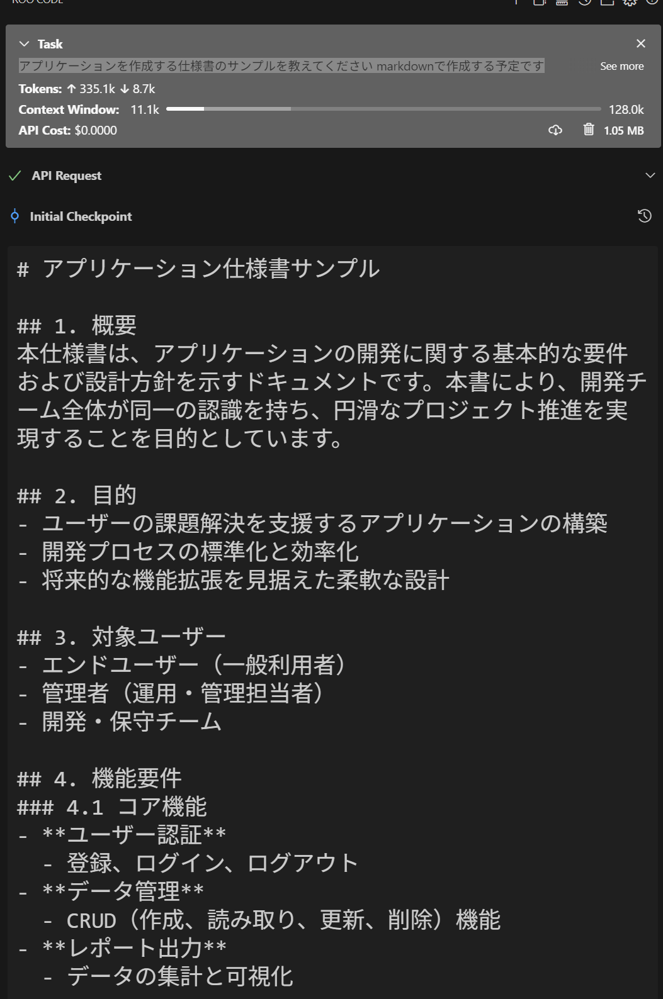

最近、WindsurfやCursorといったAIアシスタント機能を備えたコードエディタが注目を集めています。
しかし、VSCodeでの開発に慣れているため、新しいエディタへの移行には躊躇があり、GitHub Copilotによるコード補完程度の利用に留まっていました。
そこで今回、VSCode上で同様のAIアシスタント機能を実現できるRooCode拡張機能を試してみることにしました。

<!-- truncate -->

## RooCodeの特徴

RooCodeには以下のような特徴があります：

### 1. VSCode拡張機能として動作

- お気に入りのエディタでAIコーディング支援を利用可能
- 既存の開発環境を大きく変更する必要がない
- VSCodeの機能や他の拡張機能と併用できる

### 2. ファイルシステムの理解

- プロジェクト内の複数のファイルを同時に読み込んで理解
- ディレクトリ構造を把握し、適切なファイル配置を提案
- 仕様書やドキュメントを読み込んでコードを生成

### 3. コンテキストを考慮した開発支援

- ファイル間の依存関係を理解した修正提案
- 既存コードのスタイルに合わせたコード生成
- プロジェクト全体を考慮したリファクタリング提案

### 4. インタラクティブな開発フロー

- 段階的な開発プロセスをサポート
- 変更内容の説明と確認を対話形式で実施
- エラーや問題点の詳細な解説と修正提案

## はじめてのRooCode

この手の王道、TODOアプリを作っていきます。

まずはRooCodeに最低限のモックアプリケーションを作成してもらいます。

## 完成したモックアプリケーション

タグをつきで登録することができるTODOアプリを作りました


以下のURLから利用できます

https://sharedo-tm-paseri.netlify.app/mock/secondmock/

開発に利用した仕様書は以下のURLで確認することができます

https://sharedo-tm-paseri.netlify.app/docs/mock1/chapter1_overview

完成したアプリケーションのソースコードは以下のURLで確認することができます

https://github.com/tm-paseri/sharedo/tree/main/doc/mock/secondmock

## RooCodeのセットアップ

今回は簡単にAIコーディングを体験することが目標のため、GitHub Copilotの無料プランを利用することにしました。

RooCodeの設定は非常にシンプルで、以下の2点を指定するだけです：

- API Provider: VS Code LM API（GitHub Copilotと連携）
- Language Model: copilot - claude-3.5-sonnet（高性能な言語モデル）


## 仕様書の雛形を作成する

AIにアプリケーションを作成してもらうため、まずは仕様書を準備します。

仕様書のフォーマットは多種多様であり、どのように作成するかは重要な検討事項です。

そこで、RooCodeに仕様書の雛形を作成してもらいました。AIが提示したフォーマットを利用することで、より効率的なコミュニケーションが期待できます。

プロンプト
```
アプリケーションを作成する仕様書のサンプルを教えてください markdownで作成する予定です
```

出力(長いので最初の少しのみ)



RooCodeが提案した仕様書の章立ては以下の通りです：

```
1. 概要
2. 目的
3. 対象ユーザー
4. 機能要件
5. 非機能要件
6. システム構成
7. UI設計
8. データベース設計
9. セキュリティ要件
10. テスト計画
11. スケジュール／マイルストーン
12. まとめ
```

提案された構成は、アプリケーション開発の基本要件（対象ユーザーや機能要件）から、リリースに向けた実務的な要素（セキュリティ、テスト計画、スケジュール）まで網羅した、包括的な仕様書のフォーマットとなっています。

とはいえモックを作るだけであればほとんどの章は必要ないので一旦以下のようにTODOと記載してサンプルはコメントアウトしておきます。

```
---
sidebar_position: 4
---

<!-- 本文をTODOのみとし、残りはコメントアウトする -->

TODO

<!--
## 4.1 コア機能
- **ユーザー認証**: 登録、ログイン、パスワードリセット
- **データ管理**: CRUD操作（作成、読み取り、更新、削除）
- **レポート出力**: 集計レポート、ダッシュボード表示

## 4.2 補助機能
- **通知機能**: メール通知、プッシュ通知
- **検索機能**: キーワード・フィルタリングによる検索
-->
```

## 最低限の仕様書を作成する

まずは最低限のアプリを作ってもらうため、以下の仕様書を作成していきます。
作成するTODOアプリの概要を記載していきます。

- 1. 概要(chapter1_overview.md)
- 2. 目的(chapter2_objectives.md)
- 3. 対象ユーザー(chapter3_target_users.md)
- 4. 機能要件(chapter4_function_requirements.md)

```markdown
# 1. 概要

本仕様書は、アプリケーションの開発に必要な各種要件や設計方針を示すドキュメントです。  
これにより、開発チーム全体が統一の認識を持ち、効率的かつ円滑なプロジェクト進行を目指します。
```

```markdown
# 2. 目的

本アプリケーションは、ユーザーが日常のあらゆるタスクややるべきことを簡単にまとめ、効率的に管理できる環境を提供することを目的としています。従来のタスク管理ツールとは一線を画し、シンプルで直感的な操作により、利用者が毎日のルーチンを一元的に把握し、整理できるよう設計されています。

- ユーザーのタスク管理の利便性向上
- 日常のやることを簡単に可視化し、合理的に整理することによる生産性の向上
```

```markdown
# 3. 対象ユーザー

タスク管理を必要とするユーザーは、以下の用途でシステムを利用します：
 
- 日常のタスク管理を効率的に行いたい
- 買い物リストやメモとして利用したい
- お出かけ時の備忘録として利用したい
```

```markdown
# 4. 機能要件

システムが提供する機能は以下の通りです。

## 4.1 コア機能
- チェックボックス形式で複数のTODOを追加可能
- TODOリストにコメントを追記可能
- TODOリストへのタグ付けとフィルタリングが可能
```

## RooCodeにアプリを作成してもらう

それでは、作成した仕様書を基にRooCodeにアプリケーションを実装してもらいます。

以下のプロンプトで開発を依頼します：
```
doc/docs以下の内容でアプリケーションを作成してください
本文にTODOと記載されたMarkdownファイルは無視してください
```

RooCodeは適切に指示を理解したようです。仕様書の解釈プロセスを詳しく見ていきましょう。


まず、概要の内容から読み取っているファイルが仕様書であることを認識できています。

はじめに読み込ませているドキュメントがどのような目的で作られているかは明示したほうがいいかもしれません。


開発するアプリの内容と


対象のユーザーも理解できています。要約もしてくれました。


機能要件の理解もOKです。


これ以降のファイルはすべてTODOとしています。

初めのプロンプトで指示した通り、TODOとなっているファイルは無視してくれています。


作成するアプリの内容を理解したうえで開発方針を示してくれました。
モックを作っている段階なので、HTML + JavaScript + CSSの一番シンプルな形で問題ありません。
動作確認をするのも簡単なので、下手にフレームワークを提示されるよりは良いかもしれません。


HTML、CSS、そしてJavaScriptを順々に作成してくれています。


無事完成です！ 動作確認方法も教えてくれています。


早速動かしてみましょう。
想定している通りの機能で動いています！


## RooCodeに作成したアプリを修正してもらう
続いて、作成したアプリケーションの機能を拡張していきます。

現在のアプリケーションでは、同一のタグを使用する場合でも毎回手動入力が必要です。
ユーザビリティを向上させるため、過去に使用したタグの入力補完機能を実装することにしました。

この機能を実現するため、仕様書の4. 機能要件に以下の項目を追加します。
早速仕様書を修正していきます。4. 機能要件に以下の項目を追加します。

```markdown
## 4.2 補助機能
- 一度入力したタグは補完される
```

RooCodeに指示してみましょう。

プロンプト
```
chapter4に修正を加えました アプリケーションを修正してください
```

指示通り修正があったファイルを確認してくれています。


変更内容を理解できています！ ソースコードの修正内容も問題なさそうなのでこのまま修正してもらいましょう。


修正完了です！ 早速動かしてみましょう。


一度入力したことのあるタグを選択して補完できるようになりました！


## まとめ

RooCodeを使用することで、従来のチャットベースのAIアシスタントとは異なる、より高度な開発支援機能を体験することができました。特に以下の点において、その優位性が際立ちました：

- プロジェクト全体のコンテキストを理解し、一貫性のある開発支援を提供
- 複数ファイルを同時に解析し、ファイル間の依存関係や影響範囲を正確に把握
- コードの変更履歴や差分を理解し、プロジェクトの文脈に沿った的確な修正を提案
- 仕様書から直接コードを生成し、要件に忠実な実装を実現

今回のチュートリアルでは、シンプルなTODOアプリのモック作成を通じて、RooCodeの基本的な機能を検証しました。仕様書をもとに指示を出すだけで、驚くほど効率的にアプリケーション開発が進められることが実証できました。

次回は、より実践的なアプリケーション開発に挑戦し、RooCodeの本格的な活用方法を探っていきます：

- 具体的な開発言語とフレームワークを指定した実装
- スケーラブルなプロジェクト構成の設計
- クロスプラットフォーム（iOS/Android/デスクトップ）開発への対応
- データベース設計とRESTful APIの実装

RooCodeを活用することで、より効率的で品質の高い開発プロセスを実現し、開発者の生産性を大幅に向上させることが期待できます。